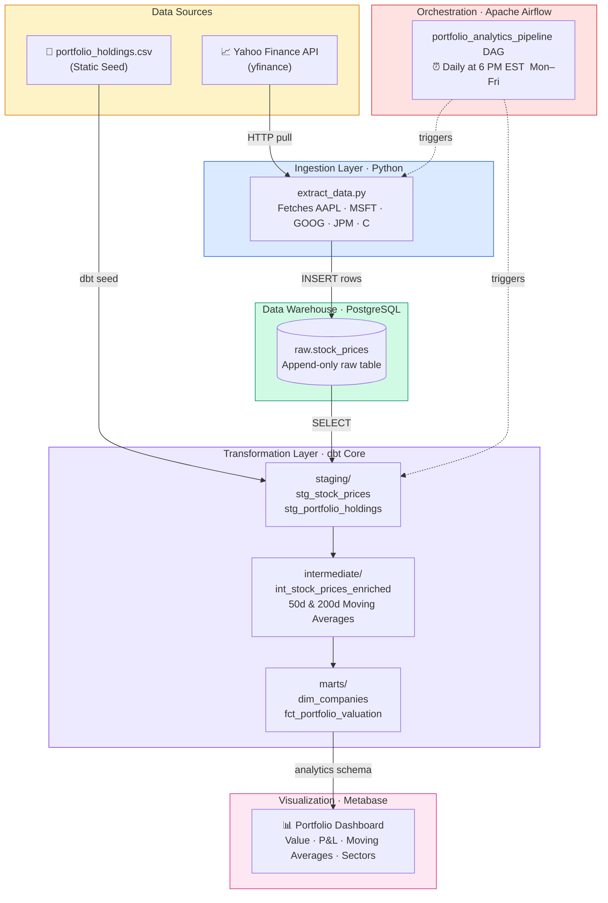
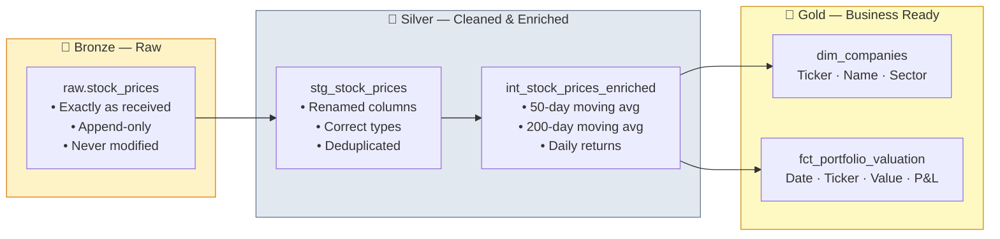
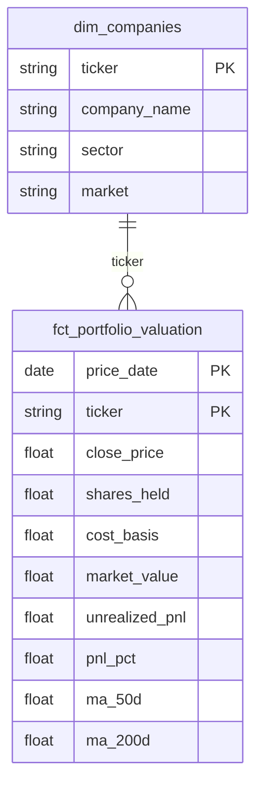
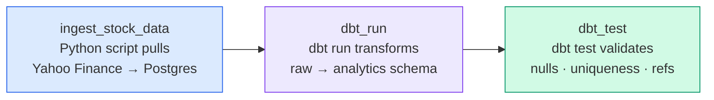

# Automated Portfolio Analytics Pipeline

An end-to-end data engineering pipeline that automatically ingests daily stock market data, stores it in a PostgreSQL data warehouse, transforms it through three analytical layers using dbt, orchestrates everything with Apache Airflow, and visualizes portfolio performance in Metabase — all running locally in Docker.

---

## Pipeline Architecture



---

## Medallion Architecture (Data Layers)

Data flows through three quality tiers — a pattern used at companies like Databricks, Airbnb, and Uber.



---

## Star Schema (Dimensional Model)

The Gold layer follows a **star schema** — the standard pattern for analytical data warehouses.



---

## Airflow DAG



---

## Tech Stack

| Layer | Tool | Purpose |
|-------|------|---------|
| Containerization | Docker + Docker Compose | Reproducible local environment |
| Data Warehouse | PostgreSQL 15 | Stores raw and analytical data |
| Ingestion | Python + yfinance | Pulls stock prices from Yahoo Finance |
| Transformation | dbt Core | SQL models, tests, and documentation |
| Orchestration | Apache Airflow 2.7 | Schedules and monitors the pipeline |
| Visualization | Metabase | Business intelligence dashboard |
| DB Admin | pgAdmin 4 | Browse and query tables manually |

---

## Project Structure

```
.
├── docker-compose.yml          # All services: Postgres, Airflow, pgAdmin, Metabase
├── .env.example                # Environment variable template (copy → .env)
├── requirements.txt            # Python dependencies
│
├── scripts/
│   └── extract_data.py         # Ingestion: Yahoo Finance → Postgres raw schema
│
├── dags/
│   └── portfolio_orchestrator.py  # Airflow DAG: daily pipeline schedule
│
└── dbt_project/
    ├── dbt_project.yml         # dbt project config and materialization strategy
    ├── profiles.yml            # Database connection settings
    ├── seeds/
    │   └── portfolio_holdings.csv  # Static: shares held per ticker
    └── models/
        ├── staging/            # Bronze → Silver: clean and cast
        ├── intermediate/       # Silver: 50d & 200d moving averages
        └── marts/              # Gold: star schema fact & dimension tables
```

---

## Local Setup

### Prerequisites
- [Docker Desktop](https://www.docker.com/products/docker-desktop/)
- Python 3.9+

### 1. Clone & configure

```bash
git clone <your-repo-url>
cd Data_Engineer
cp .env.example .env        # Edit .env with your passwords
```

### 2. Start all services

```bash
docker-compose up airflow-init   # One-time database setup
docker-compose up -d             # Start everything in background
```

### 3. Access the tools

| Service | URL | Credentials |
|---------|-----|-------------|
| Airflow UI | http://localhost:8080 | admin / admin |
| pgAdmin | http://localhost:8082 | admin@admin.com / admin |
| Metabase | http://localhost:3000 | Set up on first visit |

### 4. Run the pipeline

In Airflow UI → enable `portfolio_analytics_pipeline` DAG → trigger manually.

---

## Key Data Engineering Concepts Demonstrated

- **ELT pattern** — Load raw data first, transform inside the warehouse (vs ETL which transforms before loading)
- **Idempotency** — The pipeline can run multiple times without duplicating or corrupting data
- **Medallion architecture** — Bronze / Silver / Gold data quality tiers
- **Star schema** — Fact and dimension tables optimized for analytical queries
- **SQL window functions** — Used in dbt to compute rolling 50-day and 200-day moving averages
- **Data quality testing** — dbt tests enforce uniqueness, non-null constraints, and referential integrity
- **Infrastructure as code** — Entire environment defined in `docker-compose.yml` and `.env`

---

## Build Status

| Phase | Status | Description |
|-------|--------|-------------|
| 1 — Infrastructure | ✅ Done | Docker, Postgres, pgAdmin |
| 2 — Ingestion | ✅ Done | Python extracts Yahoo Finance → raw schema |
| 3 — Orchestration | 🔧 In Progress | Airflow DAG defined, pending verification |
| 4 — Transformation | ⬜ Planned | dbt staging → intermediate → marts |
| 5 — Visualization | ⬜ Planned | Metabase dashboard |
